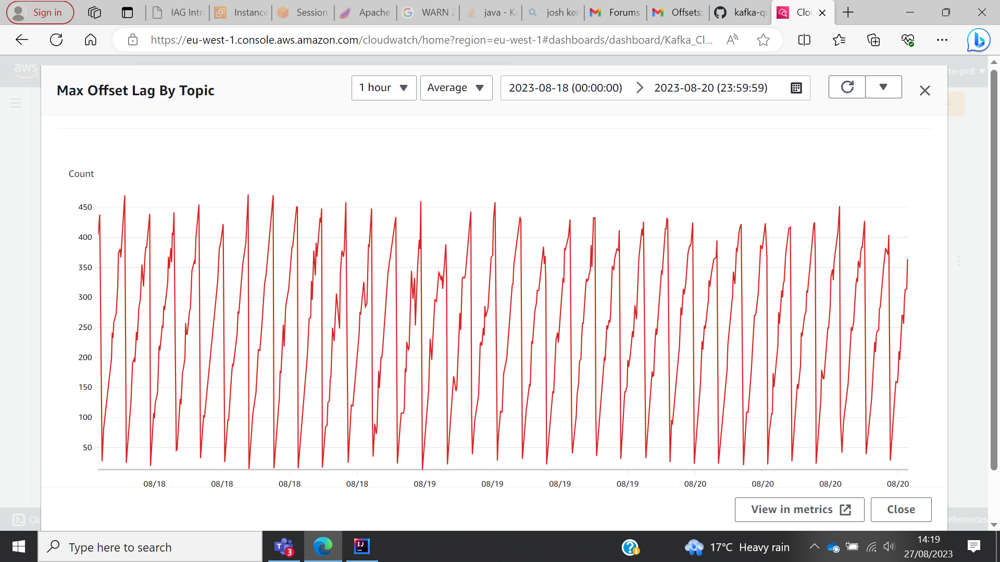

# Read me
Odd periodic offset

This data is sampled once a minute-- and I get (sort of) that the graph is probably not showing the real period due to the sample rate (Nyquist sampling) but I can't really explain why we have a period in offset lag in the first place. The system is not resource constrained. The consumer when first turned on was set at "earliest" and consumed at much higher rates to clear the initial back log. What is taking place here?

Consumer set up:
An http sink connector running on MSK connect with 1 worker / 2 tasks (It could scales but does not)

